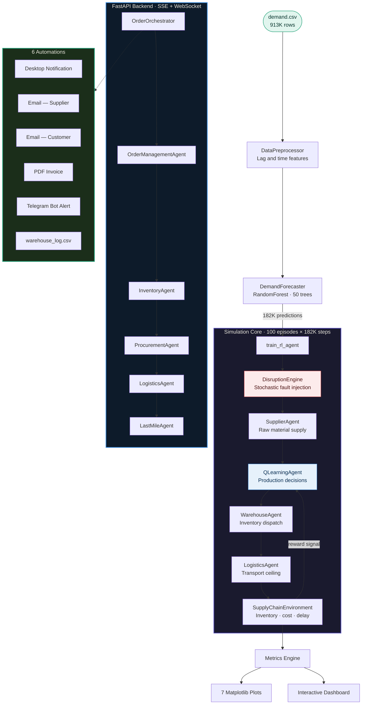
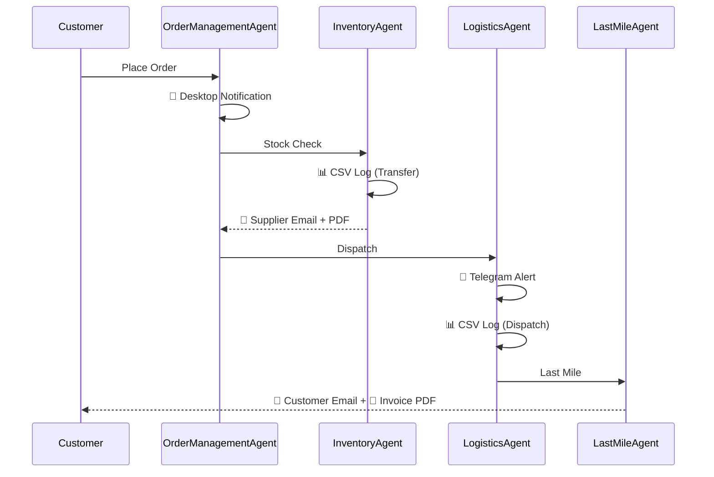
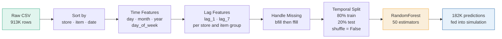
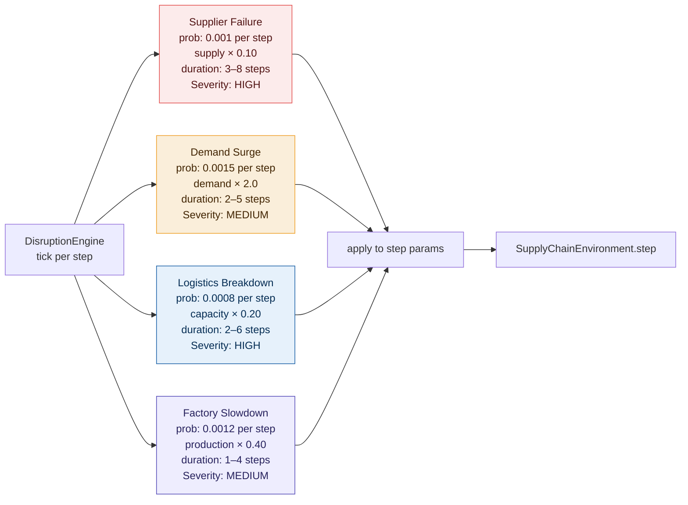

<div align="center">


<br/>

[](https://python.org)
[](https://fastapi.tiangolo.com)
[](https://scikit-learn.org)
[]()
[](https://chartjs.org)
[](LICENSE)

<br/>

[](/)
[](/)
[](/)
[](/)
[](/)
[](https://debnil-dey.github.io/smart-manufacturing-ml-mas/)

<br/>

> **A production-grade Machine Learning driven Multi-Agent System for dynamic resource allocation in smart manufacturing supply chains — featuring Q-Learning RL, 12 autonomous agents, 6 real-time automations, a dual-frontend (Shop + MAS Ops Dashboard), and a disruption-resilient order fulfilment pipeline.**

<br/>

[**🌐 Live Dashboard**](https://Debddj.github.io/smart-manufacturing-ml-mas/) &nbsp;·&nbsp; [**📄 Technical Report**](REPORT.md) &nbsp;·&nbsp; [**📊 View Results**](#key-results) &nbsp;·&nbsp; [**🚀 Get Started**](#quick-start)

</div>

---

## Table of Contents

- [Overview](#overview)
- [Key Results](#key-results)
- [System Architecture](#system-architecture)
- [The 12 Agents](#the-12-agents)
- [6 Real-Time Automations](#6-real-time-automations)
- [Dual Frontend](#dual-frontend)
- [Machine Learning Pipeline](#machine-learning-pipeline)
- [Reinforcement Learning](#reinforcement-learning)
- [Disruption Engine](#disruption-engine)
- [Interactive Dashboard](#interactive-dashboard)
- [Visualisations](#visualisations)
- [Project Structure](#project-structure)
- [Quick Start](#quick-start)
- [Configuration](#configuration)
- [Tech Stack](#tech-stack)
- [Team](#team)

---

## Overview

Smart Manufacturing ML-MAS simulates a real-world production ecosystem where **12 autonomous agents** collaborate under uncertain demand and active supply chain disruptions. The system learns optimal resource allocation policies using **Q-Learning reinforcement learning**, continuously improving across 100 training episodes.

The platform has evolved through 27 commits from a basic 4-agent simulation into a **full-stack supply chain platform** with:

- **12 specialised agents** — from order intake to last-mile delivery
- **6 real-time automations** — desktop notifications, email (supplier + customer), PDF invoices, Telegram alerts, warehouse CSV logging
- **Dual frontend** — customer-facing Shop UI + real-time MAS Operations Dashboard
- **FastAPI backend** — SSE/WebSocket streaming of live agent events
- **A2A message bus** — priority-queue pub/sub for decentralised agent communication
- **Multi-warehouse network** — 3-node inventory with Branch A/B/C routing
- **UCP commerce layer** — product catalog with discovery, cart, and checkout
- **Decentralised supplier network** — 5 supplier nodes with smart contract engine

The project answers one industry-critical question:

> *How much better is an RL-driven supply chain than a human heuristic planner — and does it hold up when things go wrong?*

**Answer:** The RL system achieves comparable service levels to the heuristic baseline at **36% lower operational cost**, and maintains a **resilience score of 0.998** under active disruptions.

---

## Key Results

<div align="center">

| Metric | Baseline (No RL) | RL System — Normal | RL System — Disrupted |
|--------|:---------:|:---------:|:---------:|
| **Fill Rate** | ~1.000 | **0.997** | **0.993** |
| **Avg Delay** | 0.05 | **0.17** | **0.39** |
| **Total Cost** | 36.17M | **23.15M** | **23.23M** |
| **Cost Saving vs Baseline** | — | **✅ +36.0%** | **✅ +35.8%** |
| **SLA ≥ 0.90** | ✅ PASS | ✅ PASS | ✅ PASS |
| **Resilience Score** | 1.000 | 1.000 | **0.998** |

</div>

> 💡 **The key insight:** The baseline over-produces to guarantee service at 36M cost. The RL system learns *just-in-time* production decisions that match service quality at 23M — a **36% cost reduction** without sacrificing a single SLA point.

---

## System Architecture



---

## The 12 Agents

The system evolved from 4 simulation agents to **12 specialised agents** spanning the entire supply chain:

### Core Simulation Agents (RL Training Loop)

| # | Agent | File | Role |
|---|-------|------|------|
| 1 | **SupplierAgent** | `agents/supplier_agent.py` | Stochastic upstream source. Batches from `[80, 120, 180]` units. Under disruption: supply × 0.10 |
| 2 | **QLearningAgent** | `rl/q_learning.py` | System intelligence. 20×20×7 Q-table mapping `(inventory, demand)` → production action |
| 3 | **WarehouseAgent** | `agents/warehouse_agent.py` | Greedy dispatcher — ships `min(inventory, demand)` every step |
| 4 | **LogisticsAgent** | `agents/logistics_agent.py` | Transport ceiling: `min(shipment, 300)`. Under disruption: capacity × 0.20 |

### Extended MAS Agents (Order Pipeline)

| # | Agent | File | Role |
|---|-------|------|------|
| 5 | **OrderManagementAgent** | `agents/order_management_agent.py` | Order state machine: RECEIVED → INVENTORY_CHECK → SOURCING → IN_TRANSIT → DELIVERED → COMPLETE |
| 6 | **InventoryAgent** | `agents/inventory_agent.py` | Global multi-warehouse view. Branch A/B/C routing decisions across 3 warehouse nodes |
| 7 | **ProcurementAgent** | `agents/procurement_agent.py` | Validates production orders. Disruption-aware safety buffers with MAX_PROCUREMENT_CAP |
| 8 | **FulfillmentAgent** | `agents/fulfillment_agent.py` | Inventory availability gate. Routes YES → LastMile, NO → SupplierDiscovery |
| 9 | **LastMileDeliveryAgent** | `agents/last_mile_agent.py` | Final delivery hop. Routes: express (≤150), standard (≤300), economy (>300) |
| 10 | **DistributionHubAgent** | `agents/distribution_hub_agent.py` | Coordinates inter-warehouse transfers (Branch B). Tracks routing efficiency |
| 11 | **SupplierDiscoveryAgent** | `agents/supplier_discovery_agent.py` | Scores 5 alternative suppliers by reliability × capacity × cost. Smart contract issuance |
| 12 | **SeasonalAgent** | *(via API endpoint)* | Context-aware seasonal stock transfers between Warehouse A and B |

---

## 6 Real-Time Automations

All six automations fire automatically during the order fulfilment pipeline via the `OrderOrchestrator`:

| # | Automation | Module | Trigger Point | Description |
|---|-----------|--------|---------------|-------------|
| 🔔 1 | **Desktop Notification** | `automations/notifications.py` | `OrderManagementAgent` after order validation | OS-level notification via `plyer`. Shows order ID, context, and validation status. *(Local only — not visible in browser recordings)* |
| 📧 2 | **Supplier Email** | `automations/email_sender.py` | After inventory routing decision | Procurement smart-contract email with PDF attachment sent to supply chain team via Gmail SMTP |
| 📧 3 | **Customer Email** | `automations/email_sender.py` | `LastMileDeliveryAgent` after dispatch | Fulfillment confirmation email with PDF invoice attached. Includes order summary, amounts with GST *(Both emails sent to same address — separate addresses require external API service)* |
| 📄 4 | **PDF Invoice Generation** | `automations/email_sender.py` | Alongside customer email | ReportLab-generated professional invoice PDF with line items, GST breakdown, SHA-256 hash, and payment terms |
| 🤖 5 | **Telegram Bot Alert** | `automations/telegram_alerts.py` | `LogisticsAgent` after goods loaded | Logistics dispatch alert sent via Telegram Bot API with order ID, units, destination, and route status |
| 📊 6 | **Warehouse Log CSV** | `automations/warehouse_logger.py` | `InventoryAgent` + `LogisticsAgent` | Auto-appends transfer/dispatch rows to `warehouse_log.csv` with timestamp, agent, action, warehouses, units, context |

### Automation Architecture



### Environment Variables Required

```env
# Gmail SMTP (for supplier + customer emails)
SENDER_EMAIL=your-email@gmail.com
SENDER_PASSWORD=xxxx-xxxx-xxxx-xxxx    # Gmail App Password (16-char)

# Telegram Bot API (for logistics alerts)
TELEGRAM_BOT_TOKEN=123456:ABC-DEF...   # From @BotFather
TELEGRAM_CHAT_ID=123456789             # Recipient chat ID
```

---

## Dual Frontend

The platform serves two HTML frontends via FastAPI:

| Frontend | Route | File | Purpose |
|----------|-------|------|---------|
| **Shop UI** | `/` or `/shop` | `frontend/shop.html` | Customer-facing product catalog with cart, checkout, environment context selection |
| **MAS Ops Dashboard** | `/dashboard` or `/mas-ops` | `frontend/mas-ops.html` | Real-time agent activity monitor with SSE/WebSocket event streaming |

Both frontends connect to the FastAPI backend which orchestrates the full MAS pipeline and streams agent events in real-time.

---

## Machine Learning Pipeline



| Property | Value |
|----------|-------|
| Total rows | 913,000 |
| Stores × Items | 10 × 50 = 500 groups |
| Mean daily sales | 52.25 units |
| Max daily sales | 231 units |

---

## Reinforcement Learning

### Q-Learning Policy

$$Q[s][d][a] \mathrel{+}= \alpha \cdot \left( r + \gamma \cdot \max_a Q[s'][d'] - Q[s][d][a] \right)$$

| Parameter | Value | Rationale |
|-----------|-------|-----------|
| State space | 20×20 bins | Inventory (0–300) × Demand (0–250) |
| Actions | `[20, 40, 60, 80, 120, 160, 200]` | Covers mean demand through surge |
| Learning rate α | 0.20 | Fast convergence without instability |
| Discount factor γ | 0.95 | Plans ~20 steps ahead |
| ε decay | ×0.97 per episode | Reaches ~0.05 by episode 100 |

### Reward Function

```python
reward = service_level × 20
       − cost × 0.005
       + 5.0  if service_level ≥ 0.90   # SLA bonus
       + 3.0  if service_level ≥ 0.95   # stretch bonus
       − excess_production × 0.05       # over-production penalty
```

---

## Disruption Engine

The disruption engine **stress-tests the trained policy** with four real-world failure modes. The RL agent **never observes disruption type directly** — it must infer from downstream signals and adapt, which is what makes the resilience score meaningful.



**Resilience results:**

| Metric | Value | Interpretation |
|--------|-------|----------------|
| Resilience Score | **0.998** | Near-zero degradation under disruption |
| Avg Recovery Steps | **0.58** | Returns to normal within 1 step of disruption ending |
| Fill During Disruption | **0.993** | Only 0.4% drop from undisrupted performance |
| Disruption Rate | **~18%** | 18% of all steps had at least one active disruption |

---

## Agent-to-Agent Communication

The `MessageBus` provides a priority-queue pub/sub system replacing direct agent calls:

- **Priority levels:** ALERT → WARNING → INFO → ACTION
- **15 message types** covering disruptions, inventory, orders, suppliers, forecasts, logistics
- **Error isolation:** handler exceptions are caught — one broken handler never blocks others
- **Capped log:** max 5,000 archived messages per episode

---

## UCP Commerce Layer

The **Universal Commerce Protocol** layer (`ucp/`) provides:

- **Product Catalog** — 5 pre-loaded industrial products with UCP-compliant listings
- **Full-text search** across name, description, category, tags
- **Real-time inventory sync** with WarehouseNetwork
- **Capability negotiation** — `/profile` endpoint for A2A/MCP discovery
- **Cart + Checkout** support for the Shop UI frontend

---

## Project Structure

```
smart-manufacturing-ml-mas/
│
├── 📂 agents/
│   ├── factory_agent.py          # Heuristic baseline (capacity-constrained production)
│   ├── logistics_agent.py        # Transport ceiling · capacity: 300 units
│   ├── supplier_agent.py         # Stochastic supply · batches: [80, 120, 180]
│   └── warehouse_agent.py        # Greedy demand dispatcher · min(inventory, demand)
│
├── 📂 data_processing/
│   └── preprocess_pipeline.py          # Lag features, temporal split
│
├── 📂 forecasting/
│   ├── demand_forecasting.py           # RandomForest inference
│   └── train_model.py                  # Training + MAE evaluation
│
├── 📂 evaluation/
│   └── metrics.py                      # Fill rate · delay · resilience
│
├── 📂 visualization/
│   └── plots.py                        # 7 matplotlib charts
│
├── 📂 tests/                           # Unit tests
│   ├── test_warehouse_network.py
│   ├── test_inventory_agent.py
│   ├── test_message_bus.py
│   ├── test_order_lifecycle.py
│   └── test_supplier_network.py
│
├── warehouse_log.csv                   # Auto-updated warehouse transfer log
├── main.py                             # Entry point — RL training pipeline
├── index.html                          # GitHub Pages dashboard
├── requirements.txt                    # Python dependencies
├── REPORT.md                           # Technical report
└── credentials.txt                     # Credential setup guide
```

---

## Quick Start

### 1. Clone and install

```bash
git clone https://github.com/Debddj/smart-manufacturing-ml-mas.git
cd smart-manufacturing-ml-mas
pip install -r requirements.txt
```

### 2. Additional dependencies for automations

```bash
pip install fastapi uvicorn python-dotenv plyer reportlab requests
```

### 3. Configure environment (for automations)

Create a `.env` file in the project root:

```env
SENDER_EMAIL=your-email@gmail.com
SENDER_PASSWORD=xxxx-xxxx-xxxx-xxxx
TELEGRAM_BOT_TOKEN=your-bot-token
TELEGRAM_CHAT_ID=your-chat-id
```

### 4. Add the dataset

```bash
# Place demand.csv in:
data/raw/demand.csv
```

### 5. Run the RL training pipeline

```bash
python main.py
```

### 6. Run the full-stack platform (Shop + Dashboard + Automations)

```bash
uvicorn api.app:app --reload --port 8000
```

Then open:
- **Shop:** http://localhost:8000/shop
- **MAS Dashboard:** http://localhost:8000/dashboard

---

## Configuration

| Parameter | File | Default | Effect |
|-----------|------|---------|--------|
| `actions` | `rl/q_learning.py` | `[20,40,60,80,120,160,200]` | Production control granularity |
| `n_bins` | `rl/q_learning.py` | `20` | More bins = richer policy |
| `alpha` | `rl/q_learning.py` | `0.20` | Learning rate |
| `gamma` | `rl/q_learning.py` | `0.95` | Discount factor |
| `episodes` | `main.py` | `100` | Training episodes |
| `USE_DQN` | `main.py` | `False` | Toggle PyTorch DQN mode |
| `REWARD_PROFILE` | `main.py` | `balanced` | `balanced / speed / cost / resilience` |
| Disruption probs | `disruption_engine.py` | `0.0008–0.0015` | Fault injection frequency |

---

## Tech Stack

<div align="center">

| Layer | Technology | Usage |
|-------|-----------|-------|
| Language | Python 3.10+ | All backend logic |
| Backend | FastAPI + Uvicorn | REST API, SSE, WebSocket |
| ML | scikit-learn | RandomForest demand forecasting |
| RL | Custom Q-Learning | 20×20 tabular, epsilon-greedy |
| Numerics | NumPy, Pandas | Q-table ops, data processing |
| Visualisation | Matplotlib | 7 static analysis plots |
| Dashboard | Chart.js 4.4.1 | Interactive browser charts |
| Frontend | Vanilla HTML/CSS/JS | Shop UI + MAS Ops Dashboard |
| Email | smtplib + Gmail SMTP | Supplier + customer notifications |
| PDF | ReportLab | Invoice + procurement contract generation |
| Notifications | plyer | OS-level desktop notifications |
| Messaging | Telegram Bot API | Logistics dispatch alerts |
| Logging | CSV (stdlib) | Warehouse transfer audit trail |

</div>

---

## Team

<div align="center">

Developed by a **5-member engineering team** as part of a smart manufacturing optimisation research project.

</div>

---

## License

Distributed under the MIT License. See [`LICENSE`](LICENSE) for details.

---

<div align="center">


**⭐ Star this repo if you found it useful**

[🌐 Live Dashboard](https://Debddj.github.io/smart-manufacturing-ml-mas/) &nbsp;·&nbsp; [🐛 Report a Bug](https://github.com/Debddj/smart-manufacturing-ml-mas/issues) &nbsp;·&nbsp; [💼 LinkedIn](https://linkedin.com/in/debnil-dey-359a25393)

</div>
